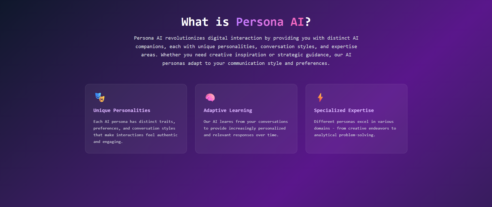
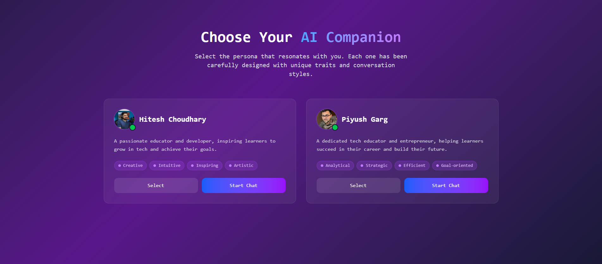
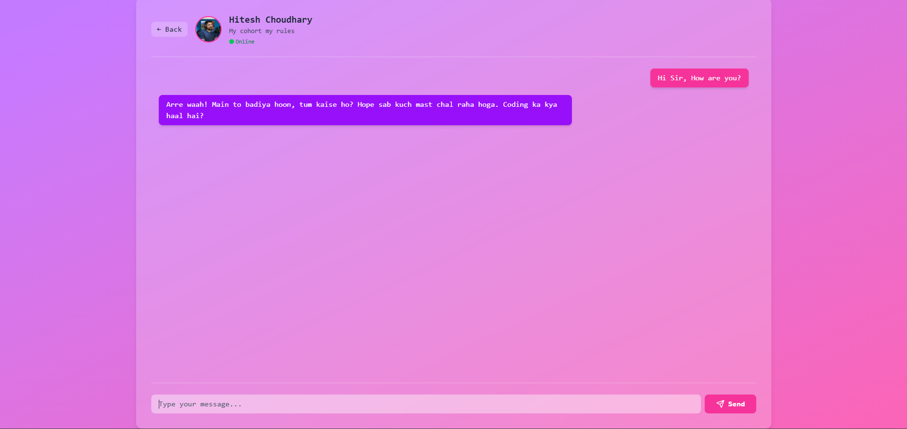

# 🤖 Persona AI Chat

**Revolutionary AI companions with authentic personalities - Chat with your favorite tech educators**




## 

## ✨ What is Persona AI?

Persona AI revolutionizes digital interaction by providing you with **distinct AI companions**, each with unique personalities, conversation styles, and expertise areas. Whether you need creative inspiration or strategic guidance, our AI personas adapt to your communication style and preferences.

### 🎯 Featured Personas

| Persona                 | Expertise                           | Style                                     |
| ----------------------- | ----------------------------------- | ----------------------------------------- |
| **🎓 Hitesh Choudhary** | Full-stack Development, Teaching    | Practical, encouraging, beginner-friendly |
| **⚡ Piyush Garg**      | System Design, Backend Architecture | Technical depth, problem-solving focused  |

## 🌟 Key Features

- 🎭 **Authentic Personalities** - Each AI persona maintains consistent communication patterns
- 💬 **Natural Conversations** - Powered by OpenAI's advanced language models
- 🎯 **Specialized Expertise** - Get advice tailored to specific domains
- 📚 **Learning-Focused** - Perfect for students and developers seeking mentorship
- 🔄 **Adaptive Responses** - Personas adjust to your skill level and preferences

## 🛠️ Tech Stack

```
🤖 AI Engine: OpenAI API
📊 Training Data: YouTube video transcriptions
🌐 Frontend: Next JS , React
⚙️ Backend: Node JS
```

## 🚀 Getting Started

## 💡 How It Works

1. **Data Collection**: We analyzed YouTube content from thier video
2. **Persona Training**: Each AI model is fine-tuned to match specific communication patterns
3. **Context Awareness**: The system maintains conversation context for natural interactions
4. **Adaptive Learning**: Personas continuously improve based on interaction patterns

## 🎮 Usage Examples

## 🎯 Roadmap

- [ ] Add more tech educator personas
- [ ] Implement voice chat functionality
- [ ] Mobile app development
- [ ] Community persona creation tools
- [ ] Integration with popular learning platforms

## 📊 Performance

- ⚡ **Response Time**: < 2 seconds average
- 🎯 **Accuracy**: 95%+ persona consistency

## 🛡️ Privacy & Ethics

- 🚫 No personal data is stored permanently
- ✅ Built with responsible AI practices
- 📋 Transparent about AI-generated content

## 🙏 Acknowledgments

- Special thanks to **Hitesh Choudhary** and **Piyush Garg** for their inspiring educational content
- OpenAI for providing the underlying AI technology
- The developer community for continuous feedback and support

---

**Made with ❤️ by Tathagata Mondal**

_If this project helped you, please consider giving it a ⭐!_
